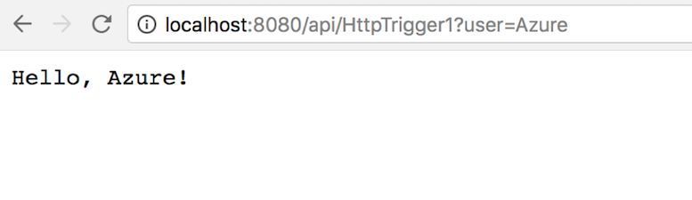

# Disclaimer

The project is currently in progress. Please **DO NOT USE IN PRODUCTION** as we expect the feature and design patterns to develop and change over time. 

If you have any feedback or requests, you can file an issue or add comments.


# Getting Started

1. **Clone the repository**

```shell
$ git clone https://github.com/Azure/azure-functions-docker-python-sample.git
```

2. **Build the app**

You are ready to build the app. Make sure you are still at the top level of your new directory. Here’s what `ls` should show:

```shell
$ ls
Dockerfile  HttpTrigger1    LICENSE    README.md    host.js requirements.txt    start.sh
```

Now run the build command. This creates a Docker image, which we’re going to tag using -t so it has a friendly name.

```shell
docker build . -t python-function-app
```

3. **Run the app**

Run the app, mapping your machine’s port 8080 to the container’s published port 8080 using -p

```shell
docker run -p 8080:8080 -it python-function-app
```

Go to the URL `http://localhost:8080` in a web browser to see the function app running. 

You can test the sample function at `http://localhost:8080/api/HttpTrigger1?user=Azure`




# Docs 

To find more documentation, open `./docs/index.html` in your browser.


# Contributing

This project welcomes contributions and suggestions.  Most contributions require you to agree to a
Contributor License Agreement (CLA) declaring that you have the right to, and actually do, grant us
the rights to use your contribution. For details, visit https://cla.microsoft.com.

When you submit a pull request, a CLA-bot will automatically determine whether you need to provide
a CLA and decorate the PR appropriately (e.g., label, comment). Simply follow the instructions
provided by the bot. You will only need to do this once across all repos using our CLA.

This project has adopted the [Microsoft Open Source Code of Conduct](https://opensource.microsoft.com/codeofconduct/).
For more information see the [Code of Conduct FAQ](https://opensource.microsoft.com/codeofconduct/faq/) or
contact [opencode@microsoft.com](mailto:opencode@microsoft.com) with any additional questions or comments.
